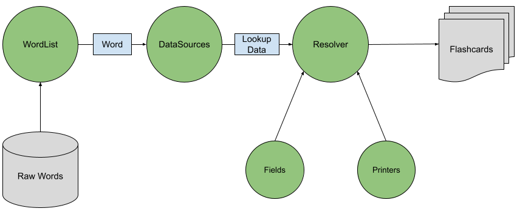

Library Overview
=======================================

This page is intended to provide a brief overview of how the individual Cardbuilder classes and packages fit together, and how they can be used to generate flashcards. Below is a simple architecture diagram expressing how data moves through Cardbuilder.

